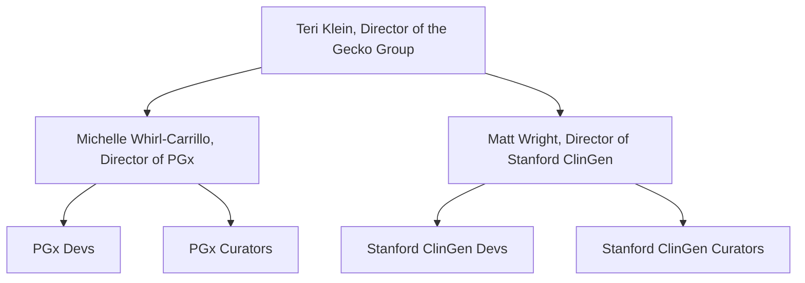

# A map of ClinGen

The Clinical Genome Resource (ClinGen) is a large organization with multiple
parts. It's supported primarily by National Institutes of Health (NIH) grants.
The three main parts of ClinGen are delineated by grants:

- Baylor/Stanford are on a grant together,
- Broad/Geisinger are on a grant together, and
- UNC has its own grant.

Baylor refers to Baylor College of Medicine in Houston, Texas. Stanford is our
part of ClinGen. Broad refers to the Broad Institute of MIT and Harvard located
in Cambridge, Massachusetts. Geisinger refers to Geisinger College of Health
Sciences located in Danville, Pennsylvania.

Each institution in ClinGen collaborates with the other institutions. We don't
yet share a code base with the other institutions. The Broad/Geisinger team has
a non-trivial amount of code available to peruse on GitHub
[here](https://github.com/clingen-data-model). I (Liam Mulhall) am not aware of
where the other institutions keep their code or if it is available to peruse.

## Stanford ClinGen

The Stanford part of ClinGen (sometimes called Stanford ClinGen) is responsible
for the gene curation interface (GCI), variant curation interface (VCI), and
soon the HLA (human leukocyte antigen) curation interface (HCI). Curation is
defined below.

> Curation is the process of collecting disparate clinical genetic and
> experimental data sources, extracting key data types, interpreting and
> evaluating them based on a specified set of criteria, and assigning context
> and relevance after careful systematic evaluation.

Basically our job as developers is to create web applications to facilitate
curation as defined above. This usually involves pulling data in from many
different sources, making it available in the interfaces, then providing a way
for curators to use that information to do their interpretations and evaluations
in a (hopefully) streamlined fashion.

### The Gecko Group

Stanford ClinGen is part of the Gecko Group at Stanford led by Teri Klein. The
organization chart looks like this:

PGx is the abbreviation for pharmacogenomics, which is the study of how genes
affect a person's response to drugs. The developers on the PGx side of the Gecko
Group work on the Pharmacogenomics Knowledgebase (PharmGKB) and other tools.
They keep their code on GitHub [here](https://github.com/PharmGKB). We have
Gecko Group meetings regularly, and we collaborate with the PGx devs where
possible.
