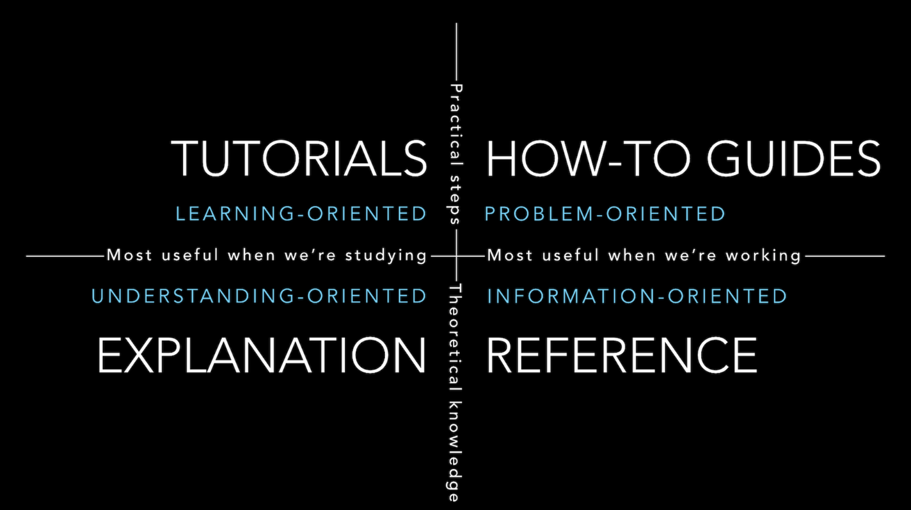

# Documentation

Going forward, we'd like to use a modified version of
[Divio's documentation system](https://docs.divio.com/documentation-system/) in
each of our projects. The following image sums up Divio's documentation system
nicely:



The idea is to have the following project structure:

```
repo
  |_doc
    |_README.md
    |_explanation.md
    |_howto.md
    |_tutorial.md
  |_src
```

In the `repo/doc/README.md` file, you should have something like the following:

```
- [Tutorials](./tutorial.md) (learning-oriented)
  - Tutorials are lessons that take the reader by the hand through a series of
    steps to complete a project of some kind. Unlike how-to guides, tutorials
    don't assume lots of prerequisite knowledge.
  - [Get started](./tutorial.md#get-started)
  - [Tutorial A](./tutorial.md#tutorial-a)
  - [Tutorial B](./tutorial.md#tutorial-b)
  - [Tutorial C](./tutorial.md#tutorial-c)
- [How-to guides](./howto.md) (problem-oriented)
  - How-to guides take the reader through the steps required to solve a
    real-world problem. They are recipes, directions to achieve a specific end.
    Unlike tutorials, they typically assume a fair amount of prerequisite
    knowledge.
  - [How to X](./howto.md#how-to-x)
  - [How to Y](./howto.md#how-to-y)
  - [How to Z](./howto.md#how-to-z)
- [Explanations](./explanation.md) (understanding-oriented)
  - Explanation, or discussions, clarify and illuminate a particular topic. They
    broaden the documentation’s coverage of a topic. Explanations can equally
    well be described as discussions; they are discursive in nature. They are a
    chance for the documentation to relax and step back from the software,
    taking a wider view, illuminating it from a higher level or even from
    different perspectives. You might imagine a discussion document being read
    at leisure, rather than over the code.
  - [Architecture](./explanation.md#architecture)
- Reference guides (information-oriented)
  - Reference guides are technical descriptions of the machinery and how to
    operate it. Reference guides have one job only: to describe. They are
    code-determined, because ultimately that’s what they describe: key classes,
    functions, APIs, and so they should list things like functions, fields,
    attributes and methods, and set out how to use them. For this project,
    reference is code comments (Python docstrings and JSDoc comments).
```

The `README.md` file serves as an introduction to the documentation system for
people who aren't familiar with it, and it serves as a table of contents.

## Code comments for reference documentation

Most programming language have special comments you can write above your
functions, classes, etc. that document the code. You can provide a high-level
overview of the code, and, for example, document each parameter to a function.
Most of our code is Python and JavaScript. These special comments are called
[docstrings](https://peps.python.org/pep-0257/) in Python. In the JavaScript
world, they are called [JSDoc](https://jsdoc.app/) comments.
