### Restore DynamoDB Table

1. (Point-in-time only) Create a new (temporary) content table via Point-in-time recovery
    1. Viewing the table to restore (content table) within the DynamoDB service console, find the **Point-in-time recovery (PITR)** area of the **Backups** tab/section and initiate a restore 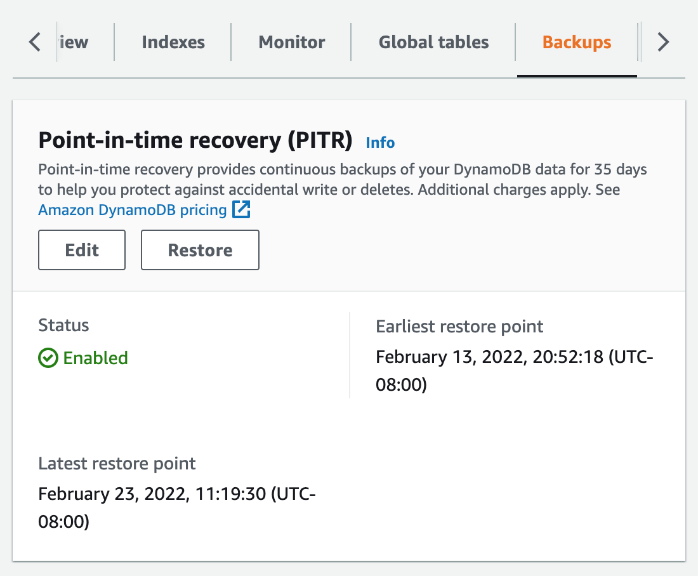 URL: *us-west-2.console.aws.amazon.com/dynamodbv2/home?region=us-west-2#table?initialTagKey=&name=[content table name]&tab=backups*
    2. Use the following restore options:
        - Table name: [content table name]-pitr (e.g. GeneVariantCuration-bwtest-pitr)
        - Point-in-time recovery: specify the date and time to which the content table needs to be reverted/restored
        - Secondary indexes: Restore the entire table (global secondary indexes are needed)
        - Region: Same Region (as content table)
        - Encryption: Owned by Amazon DynamoDB (should match setting of content table)

 

2. (Point-in-time only) Create a backup of the new (temporary) content table
    1. Viewing the new (temporary) content table within the DynamoDB service console, find the **Backups** area of the **Backups** tab/section and select **Create on-demand backup** under **Create backup** 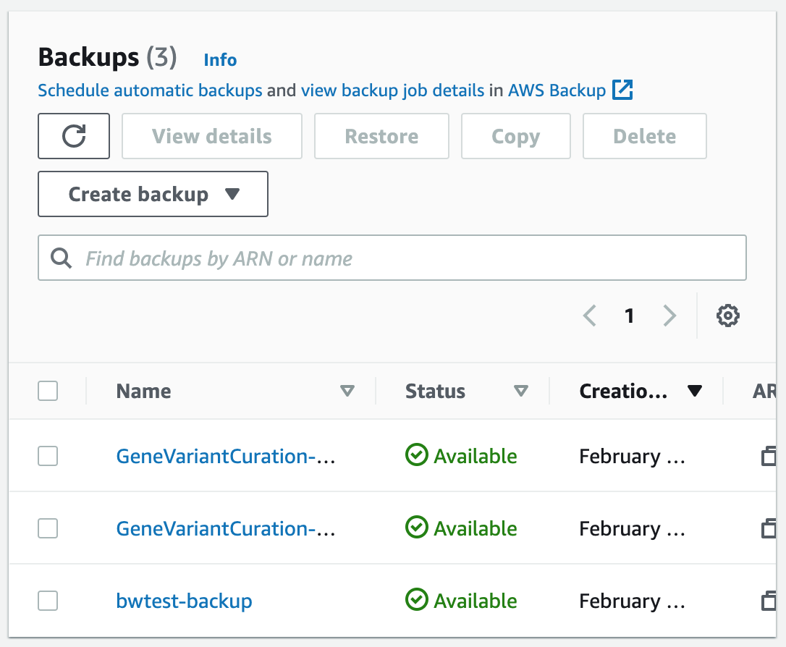 URL: *us-west-2.console.aws.amazon.com/dynamodbv2/home?region=us-west-2#table?initialTagKey=&name=[content table name]&tab=backups*
    2. Use the following backup options:
        - Backup settings: Customize settings
        - Backup management: Backup with DynamoDB
        - Backup name: [content table name]-pitr-backup

 

3. Make sure the necessary backup table exists
    1. Find the backup table on the **Backups** page of the DynamoDB service console and confirm its status is **Available** 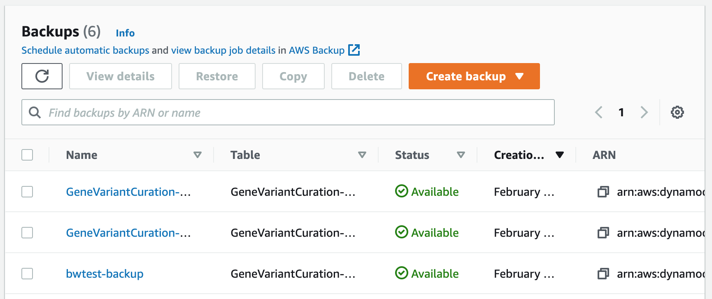 URL: *us-west-2.console.aws.amazon.com/dynamodbv2/home?region=us-west-2#list-backups*

 

4. Prevent users from making any changes to the data/table
    - Add a maintenance mode to the app?
    - Disable user access via Cognito?
    - Use access control in Amplify?

 

5. Disable trigger that updates the history table when the content table is modified (to avoid generating errors when the content table is deleted)
    1. Viewing the content table within the DynamoDB service console, find the **Trigger** area of the **Exports and streams** tab/section and click on the "gci-vci-history-trigger" function name (which should open the Lambda function) 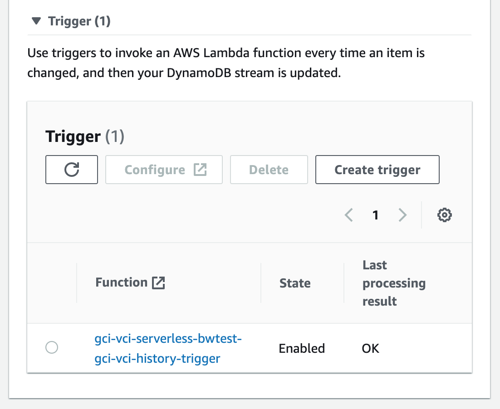 URL: *us-west-2.console.aws.amazon.com/dynamodbv2/home?region=us-west-2#table?initialTagKey=&name=[content table name]&tab=streams*
    2. Viewing the "gci-vci-history-trigger" function within the Lambda service console, go to the **Configuration** tab/section and click on **Triggers** from the navigation panel 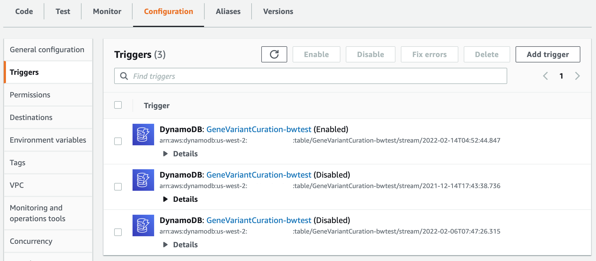 URL: *us-west-2.console.aws.amazon.com/lambda/home?region=us-west-2#/functions/[trigger function name]?tab=configure*
    3. Click the checkbox of the enabled trigger (title should be DynamoDB: [content table name] (Enabled)) and select the **Disable** button

 

6. Delete the content table
    1. Viewing the content table within the DynamoDB service console, go to **Actions** and choose **Delete table** 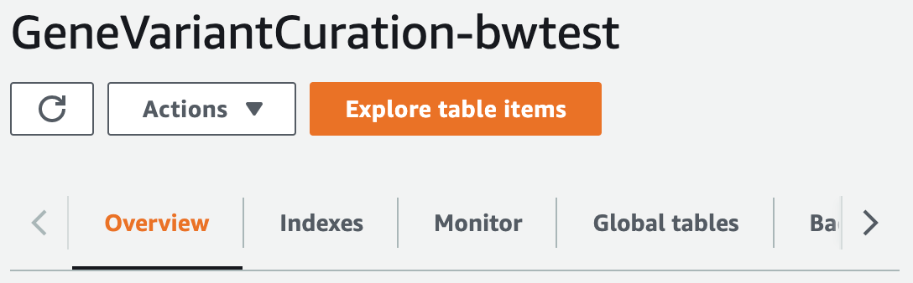 URL: *us-west-2.console.aws.amazon.com/dynamodbv2/home?region=us-west-2#table?initialTagKey=&name=[content table name]&tab=overview*
    2. Use the following delete options:
        - Select: Delete all CloudWatch alarms for this table.

 

7. Restore the content table from backup (to its original name)
    1. Select the backup table on the **Backups** page of the DynamoDB service console and choose **Restore**  URL: *us-west-2.console.aws.amazon.com/dynamodbv2/home?region=us-west-2#list-backups*
    2. Use the following restore options:
        - Table name: [content table name]
        - Secondary indexes: Restore the entire table (global secondary indexes are needed)
        - Region: Same Region
        - Encryption: Owned by Amazon DynamoDB

 

8. Enable Point-in-time recovery (PITR) on the restored content table
    1. Viewing the restored content table within the DynamoDB service console, find the **Point-in-time recovery (PITR)** area of the **Backups** tab/section and choose **Edit** 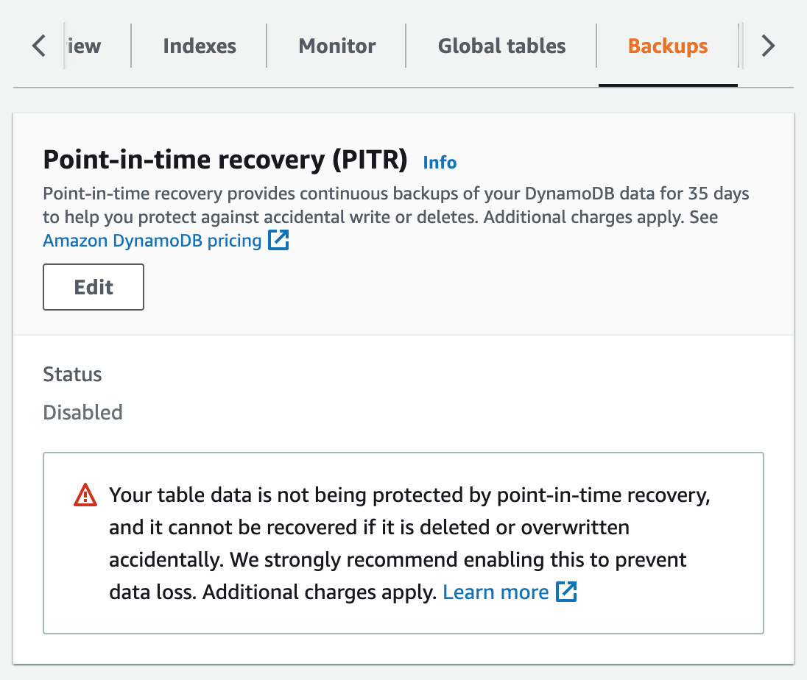 URL: *us-west-2.console.aws.amazon.com/dynamodbv2/home?region=us-west-2#table?initialTagKey=&name=[content table name]&tab=backups*
    2. Use the following enable option:
        - Select: Enable point-in-time-recovery

 

9. Restore trigger that updates the history table when the content table is modified (in order to maintain an accurate record of content changes)
    1. Viewing the restored content table within the DynamoDB service console, find the **DynamoDB stream details** area of the **Exports and streams** tab/section and choose **Enable** 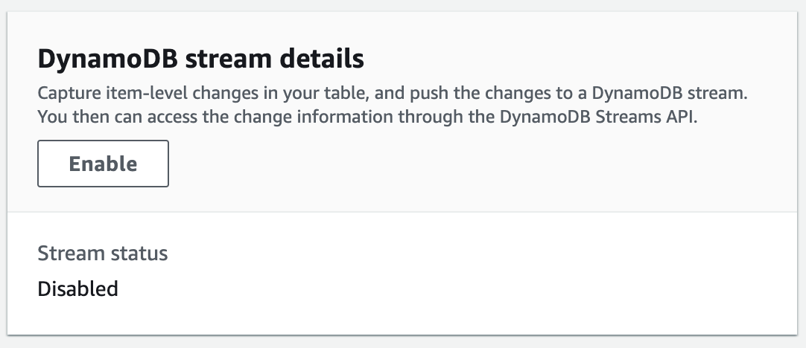 URL: *us-west-2.console.aws.amazon.com/dynamodbv2/home?region=us-west-2#table?initialTagKey=&name=[content table name]&tab=streams*
    2. Use the following enable option:
        - Select: New and old images
    3. Record/Copy the new stream ARN under **Latest stream ARN** 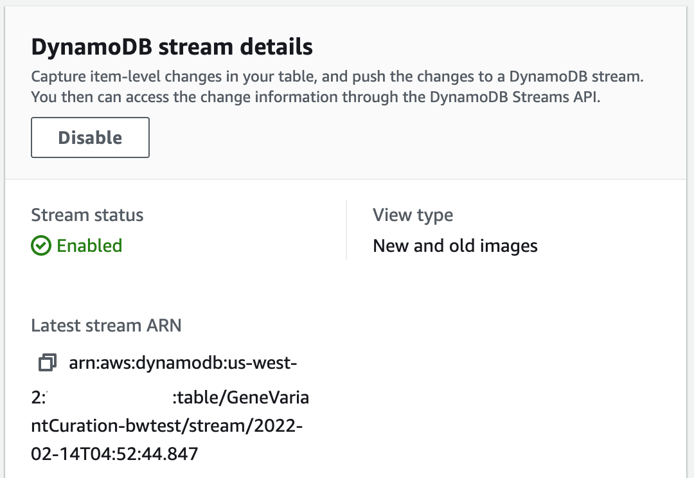 URL: *us-west-2.console.aws.amazon.com/dynamodbv2/home?region=us-west-2#table?initialTagKey=&name=[content table name]&tab=streams*
    4. Returning to the view of the "gci-vci-history-trigger" function within the Lambda service console, go to the **Configuration** tab/section and click on **Permissions** from the navigation panel 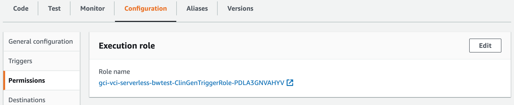 URL: *us-west-2.console.aws.amazon.com/lambda/home?region=us-west-2#/functions/[trigger function name]?tab=configure*
    5. Within the **Execution role** area, click on the "ClinGenTriggerRole" role name (which should open the IAM role)
    6. Viewing the "ClinGenTriggerRole" role within the IAM service console, find the **Permissions policies** area of the **Permissions** tab/section and click on the "clingenhistory" policy name 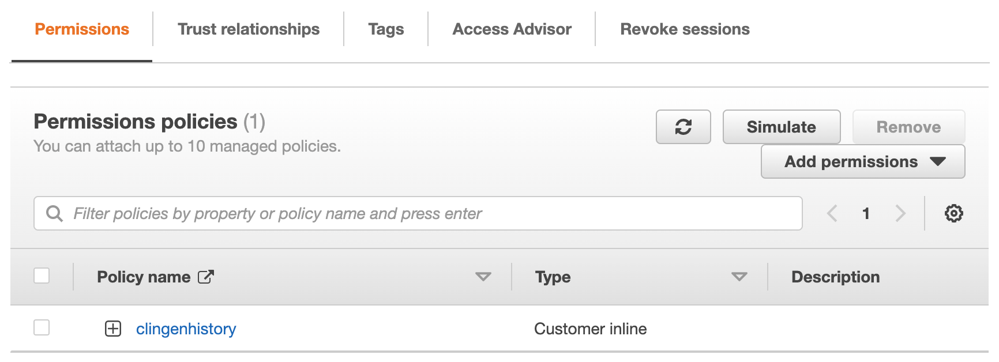 URL: *console.aws.amazon.com/iamv2/home#/roles/details/[execution role name]?section=permissions*
    7. Click on the **JSON** tab and update the one reference to the content table's stream ARN 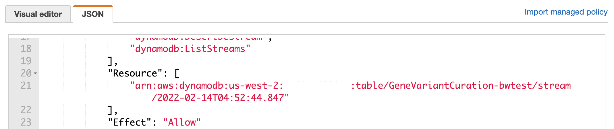 URL: *console.aws.amazon.com/iam/home#/roles/[execution role name]$jsonEditor?policyName=clingenhistory&step=edit*
    8. Returning to the view of the restored content table within the DynamoDB service console, choose **Create trigger** 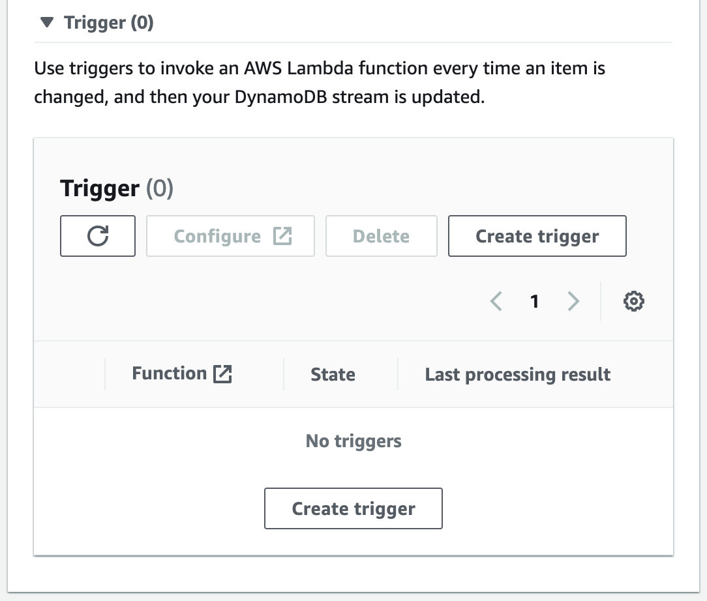 URL: *us-west-2.console.aws.amazon.com/dynamodbv2/home?region=us-west-2#table?initialTagKey=&name=[content table name]&tab=streams*
    9. Use the following create options:
        - Lambda function: "gci-vci-history-trigger" function (specific to the deployment of interest, e.g. gci-vci-serverless-bwtest-gci-vci-history-trigger)
        - Batch size: 10
        - Select: Enable trigger

 

10. Restoration of other functionality/services tied to the content table (such as CloudWatch alarms)?

 

11. Confirm restored content table is accessible from deployed application
    - Within the app, visit multiple curations, gene and variant, to confirm the presence of evidence, evaluations, saved classifications/interpretations, etc.
    - Specific to the VCI, confirm that curation audit trails have data
    - Check that VP search results include VCI interpretation data?
    - **If not testing the production app/data**, add gene and variant curations and confirm all data appears as expected

 

12. Restore user access to the data/application
