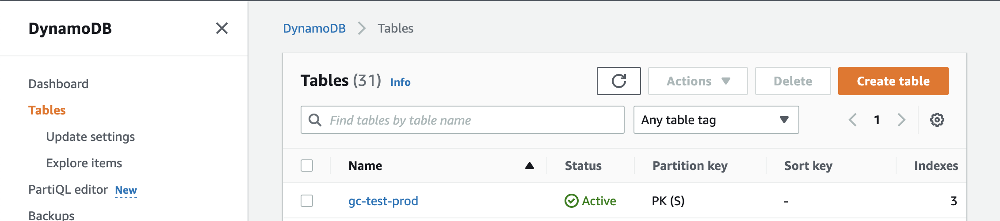

### Update User's Email

**1. Check user access status in Cognito**

- Login to [AWS Management Console](https://clingen.awsapps.com/start#/)
- Go to Cognito service

 
   **URL:** *us-west-2.console.aws.amazon.com/cognito/v2/idp/user-pools?region=us-west-2*

- Under **User pools** panel, use filter to find the production user pool from table and click the name
- Under **Users** tab, change **User name** to **Email address** from dropdown
- Enter email to search user

 
   **URL:** *us-west-2.console.aws.amazon.com/cognito/v2/idp/user-pools/us-west-[id]/users?region=us-west-2*

- If old and new email is different by lower/upper case in some character(s), both entries will be returned since email is not case sensitive in Cognito.  Sometimes, the given old/new email is different from the returned result(s) in lower/upper case.  The email in Cognito is the one being used so double check with user if there's any concerns.

- Check returned user(s) status

   1. The user with old email, usually have following attribute/value:

      Email verified = Yes

      Confirmation status = Confirmed

      Status = Enabled

   2. The user with new email, values can be different depends on what stage this user is at:

      Email verified = Yes/No

      Confirmation status = Confirmed/Unconfirmed/Reset required

      Status = Enabled/Disabled

**2. Check user status in DynamoDB**

- Login in to [ClinGen site](https://curation.clinicalgenome.org/)
- Go to [users page](https://curation.clinicalgenome.org/users/)
- Search by email or user name
- Check status in **User Status** column
   Status can be Active/Inactive/Requested Activation

    *(Note: A record may not be found for new email.)*

**3. Check what steps are needed in DynamoDB and Cognito** 

  Depends on data in Cognito and DynamoDB, follow different steps

>         Entry with old email in Cognito         Entry with new email in Cognito
>         User record with old email in DynamoDB  No user record with new email in DynamoDB
> 
>         ► In user item of DynamoDB, update email attribute from old email to new email
>         ► In Cognito, disable old email user's access.  And make sure new email user's access is enabled.
> 

>         Entry with old email in Cognito         Entry with new email in Cognito
>         User record with old email in DynamoDB  User record with new email in DynamoDB
> 
>         If want to keep user record with old email in DynamoDB (e.g. user has associated curations)
>         ► In user with new email item of DynamoDB, change attribute email to email.do.not.match, change user_status to "inactive", and add/change status="deleted"
>         ► In user with old email item of DynamoDB, update email attribute from old email to new email
>         ► In Cognito, disable old email user's access. And make sure new email user's access is enabled.
> 
>         If want to use user record with new email in DynamoDB (e.g. old user has not been activated, has no associated curation)
>         ► In user with old email item of DynamoDB, change attribute email to email.do.not.match, change user_status to "inactive", and add/change status="deleted"
>         ► In user with new email item of DynamoDB, check user_status should either be "active" or "requested activation".
>         ► In Cognito, disable old email user's access.  And make sure new email user's access is enabled.
> 

**4. Update data in DynamoDB**

- Login to AWS Management Console and go to DynamoDB service

   **URL:** *us-west-2.console.aws.amazon.com/dynamodbv2/home?region=us-west-2#dashboard*

- Select **Tables** from the navigation panel to get to **Tables** view

 
   **URL:** *us-west-2.console.aws.amazon.com/dynamodbv2/home?region=us-west-2#tables*

- Use filter to find production content table
- Click on table name link to open table panel at right hand side
- From table panel, click on **Explore table items** button to query database

 
   **URL:** *us-west-2.console.aws.amazon.com/dynamodbv2/home?region=us-west-2#table?initialTagKey=&name=[production content table name]&tab=overview*

- Under **Scan/Query items** section, click on **Query** tab
- From **Table or index** dropdown, select **item_type_index**
- In **item_type (Partition key)** field, enter "user"

 
   **URL:** *us-west-2.console.aws.amazon.com/dynamodbv2/home?region=us-west-2#item-explorer?initialTagKey=&table=[production content table name]*

- Scroll down and click on ► **Filters** to open filters section and add following filter

  Attribute name = "email"

  Type = "String"

  Condition = "Equal to"

  Value = user's email address

- Click **RUN** orange button to start the search

 
   **URL:** *us-west-2.console.aws.amazon.com/dynamodbv2/home?region=us-west-2#item-explorer?initialTagKey=&table=[production content table name]*

- Scroll down to **Items returned** section to see search result (one entry should be returned)
- Click on PK link under **PK** column to access the record and make changes
- On **Item editor** page, can view data in Form or Json format by toggling the **Form|JSON** tab on top right corner
- Make the necessary changes and click **Save changes** button at the bottom

 
   **URL:** *us-west-2.console.aws.amazon.com/dynamodbv2/home?region=us-west-2#edit-item?table=[prod content table name]&itemMode=2&pk=[user PK]&sk&ref=%23item-explorer%3Ftable%3D[production content table name]&route=ROUTE_ITEM_EXPLORER*

**5. Disable user access in Cognito**

- Following same instructions in Step 1 to find the user entry that you want to update in Cognito
- Click on link under **User name** column to get to **User information** page
- Under the user PK, from **Actions** dropdown list, select **Disable user access**
- Click **Disable** button to confirm action from popup

 
   **URL:** *us-west-2.console.aws.amazon.com/cognito/v2/idp/user-pools/us-west-2_[id]/users/details/[cognito user name]?region=us-west-2*
